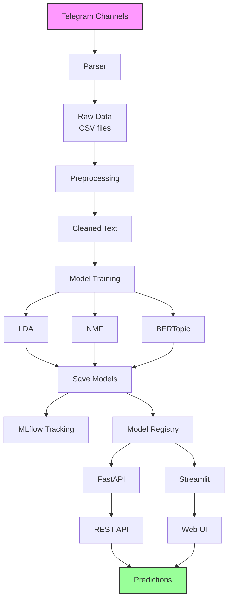

# Aviation Topic Pipeline 

Полноценный пайплайн для тематического моделирования текстов авиационной тематики из Telegram-каналов. От сбора данных до веб-интерфейса для анализа и визуализации.


## Основные возможности
- Мультимодельный подход: LDA, NMF и BERTopic для комплексного анализа
- Полный MLOps пайплайн: MLflow для трекинга экспериментов, DVC для управления данными
- API: FastAPI с автоматической загрузкой моделей
- Интерактивный веб-интерфейс: UI на Streamlit
- Docker-поддержка: Простое развертывание с контейнеризацией
- Telegram-интеграция: Встроенный парсер для сбора данных
- Конфигурируемый пайплайн: YAML-конфигурация для работы с моделями

 Структура проекта
```
Aviation-topic-pipeline/
├── app/                            # FastAPI приложение + Streamlit UI
│   ├── main.py                     # FastAPI приложение
│   ├── config.py                   # Конфигурация приложения
│   ├── services.py                 # Сервисный слой для моделей
│   ├── schemas.py                  # Pydantic схемы
│   └── streamlit_app.py            # Streamlit дашборд
├── modeling/                       # Пайплайн обучения
│   ├── src/                        # Исходный код
│   │   ├── main.py                 # Основной скрипт обучения
│   │   ├── models.py               # Реализации моделей
│   │   ├── preprocessor.py         # Предобработка текста
│   │   └── utils.py                # Утилиты
│   └── config/                     # Конфигурационные файлы
│       ├── config.yaml             # Основная конфигурация
│       └── experiment/             # Конфигурации экспериментов
├── parsing/                        # Сбор данных
│   └── telegram-parser.py          # Парсер Telegram-каналов
├── notebooks/                      # Jupyter ноутбуки для анализа
├── data/                           # Хранение данных (управляется DVC)
│   ├── raw/                        # Сырые данные из Telegram
│   └── processed/                  # Обработанные данные
├── models/                         # Сериализованные модели
├── mlruns/                         # MLflow трекинг экспериментов
├── my-artifacts/                   # DVC артефакты
├── Dockerfile                      # Docker конфигурация
├── Dockerfile.light                # Конфигурация облегченного Docker образа
├── pyproject.toml                  # Poetry зависимости
├── requirements*.txt               # Файлы требований
└── .env.example                    # Шаблон переменных окружения
```


## Инструкция по запуску
### Предварительные требования
- Python 3.10+
- Docker
- Telegram API credentials

### Установка
```
# Клонирование репозитория
git clone https://github.com/Aleksandr-Tokmashov/Aviation-topic-pipeline.git
cd Aviation-topic-pipeline
```

### Запуск инференс-сервиса с Docker
**! Важно**: На данный момент можно поднять инференс сервис только с моделями LDA и NMF. BERTopic и данные хранятся в удаленном репозитории и для доступа к ним посредством DVC необходимы реквизиты. Но пользоваться моделями NMD и LDA можно и в таком варианте. \
**Облегченная версия (без BERTopic):**
```
docker build -t avia-pipeline -f Dockerfile.light . && docker run --name topic-model-service -p 8000:8000 avia-pipeline
```
**C BERTopic:**
```
docker build -t avia-pipeline . && docker run --name topic-model-service -p 8000:8000 avia-pipeline
```
Перейти на: http://localhost:8000/docs

### Ручная настройка
При использовании Poetry запускать через poetry run ...
1. Сбор данных
```
# Настройте Telegram API в .env
# Запустите парсер для конкретных каналов
python parsing/telegram-parser.py
```
2. Запуск пайплайна обучения
```
cd modeling
python src/main.py --config config/config.yaml
```
3. Запуск API сервера
```
cd app
uvicorn main:app --reload --host 0.0.0.0 --port 8000
```
4. Запуск веб-интерфейса
```
streamlit run app/streamlit_app.py
```

## Конфигурация
### Переменные окружения
Создайте файл .env из .env.example:

```
# Telegram API
API_ID=ваш_api_id
API_HASH=ваш_api_hash
PHONE=ваш_номер_телефона
```

### Конфигурация моделей
Редактируйте YAML файлы в modeling/config/:

- config.yaml - Основная конфигурация пайплайна
- experiment/lda.yaml - Параметры LDA
- experiment/nmf.yaml - Параметры NMF
- experiment/bertopic.yaml - Параметры BERTopic

##  Доступные модели
1. LDA (Latent Dirichlet Allocation)
    - Вероятностная модель

    - Хорошо подходит для обнаружения абстрактных тем

    - Конфигурируется в experiment/lda.yaml

2. NMF (Non-negative Matrix Factorization)
    - Линейно-алгебраический подход

    - Производит более интерпретируемые темы

    - Конфигурируется в experiment/nmf.yaml

3. BERTopic
    - Основан на трансформерных эмбеддингах

    - Учитывает семантическое сходство

    - Конфигурируется в experiment/bertopic.yaml

### Интеграция с MLflow
Отслеживайте эксперименты и сравнивайте модели:

```
# Запуск MLflow UI
mlflow ui --port 5000
```

### Схема пайплайна

## Лицензия
Этот проект лицензирован под MIT License - смотрите файл LICENSE для деталей.

